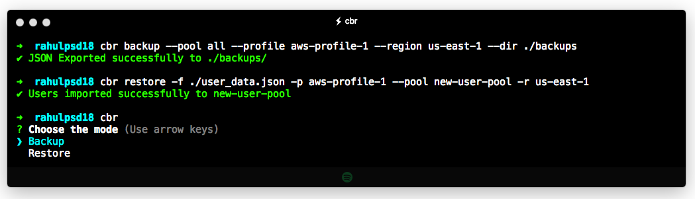
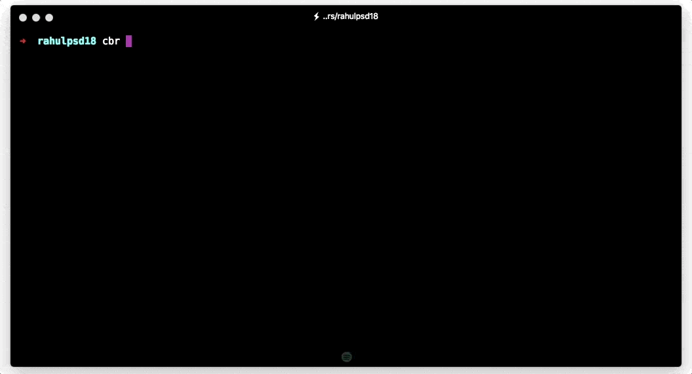
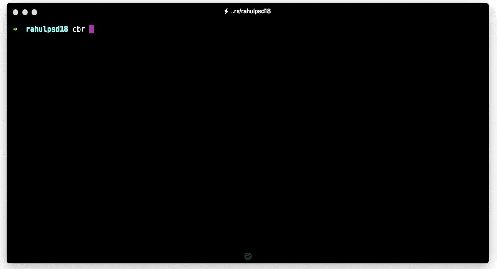

# cognito-backup-restore

AIO Tool for backing up and restoring AWS Cognito User Pools

Amazon Cognito is awesome, but has its own set of limitations. Currently there is no backup option provided in case we need to take backup of users (to move to another service) or restore them to new Userpool.

`cognito-backup-restore` tries to overcome this problem by providing a way to backup users from cognito pool(s) to json file and vice-versa.

> **Please Note:** *There is no way of getting passwords of the users in cognito, so you may need to ask them to make use of ForgotPassword to recover their account.*


## Requirements

Requires node 6.10 or newer

## Installation

`cognito-backup-restore` is available as a package on [npm](https://www.npmjs.com/package/cognito-backup-restore).

```shell
npm install -g cognito-backup-restore
```

## Usage

`cognito-backup-restore` can be used by importing it directly or via [CLI](#cli) (recommended).

### Imports

Make sure you have installed it locally `npm install --save cognito-backup-restore`. Typings are available and included.

```typescript
import * as AWS from 'aws-sdk';
import {backupUsers, restoreUsers} from 'cognito-backup-restore';

const cognitoISP = new AWS.CognitoIdentityServiceProvider();

// you may use async-await too
backupUsers(cognitoISP, <USERPOOL-ID>, <directory>)
  .then(() => console.log(`Backup completed`))
  .catch(console.error)

restoreUsers(cognitoISP, <USERPOOL-ID>, <JSON-File>, <Password?>)
  .then(() => console.log(`Restore completed`))
  .catch(console.error)
```

This is useful incase you want to write your own wrapper or script instead of using CLI.


### CLI
Run `cognito-backup-restore` or `cbr` to use it. Make use of `-h` for help.

```shell
cbr <command> [options]
```

> Available options are:
>
> `--region` `-r`: The region to use. Overrides config/env settings
>
> `--userpool` `--pool`: The Cognito pool to use. Possible value of `all` is allowed in case of backup.
>
> `--profile` `-p`: Use a specific profile from the credential file. Key and Secret can be passed instead (see below).
>
> `--aws-access-key` `--key`: The AWS Access Key to use. Not to be passed when using `--profile`.
>
> `--aws-secret-key` `--secret`: The AWS Secret Key to use. Not to be passed when using `--profile`.



- **Backup**
  ```shell
  cbr backup
  cbr backup <options>
  ```
  `--directory` option is available to export json data to.

  

- **Restore**
  ```shell
  cbr restore
  cbr restore <options>
  ```
  `--file` option is available to read the json file to import from.

  `--pwd` option is available to set TemporaryPassword of the users. If not provided, cognito generated password will be used and email will be sent to the users with One Time Password.

  `--pwdModule` option is available to make use of custom logic to generate password. If not provided, cognito generated password will be used and email will be sent to the users with One Time Password, unless `--pwd` is used. Make sure to pass absolute path of the file. Refer [this](https://github.com/rahulpsd18/cognito-backup-restore/pull/1).

  

**In case any of the required option is missing, a interactive command line user interface kicks in to select from.**

## Todo

- [X] ~~Fine tune the backup process~~
- [X] ~~Implement Restore~~
- [X] ~~Write detailed Readme with examples~~
- [ ] Convert JSON to CSV
- [ ] Implement Amazon Cognito User Pool Import Job
- [ ] AWS Cross-Region Cognito Replication
